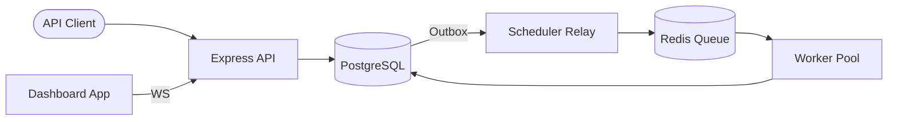

# Pulsar Job Engine

[](https://nodejs.org/)
[](https://www.postgresql.org/)
[](https://redis.io/)

Pulsar is a **high-performance, reliable background job engine** built for modern Node.js ecosystems. It bridges the gap between traditional database persistence and high-speed queueing by implementing the **Transactional Outbox Pattern**, ensuring that no job is ever lost or double-processed.

---

## Key Features

- **Guaranteed Atomicity**: Uses the Transactional Outbox Pattern to synchronize PostgreSQL updates with Redis enqueues.
- **High Performance**: Leverages Redis Sorted Sets for sub-millisecond priority-based job retrieval.
- **Dynamic Autoscaling**: Automatically scales worker concurrency based on real-time queue depth.
- **Real-time Dashboard**: A beautiful Next.js-based monitoring interface with live WebSocket updates.
- **Exponential Backoff**: Built-in retry logic with configurable backoff strategies.
- **Developer Friendly**: Fully typed with TypeScript, extensive documentation, and easy Docker-based setup.

---

## Architecture at a Glance

Pulsar splits responsibilities across three main layers:

1.  **API Layer**: Handles job submission and management via REST endpoints.
2.  **Relay Layer**: Monitors the PostgreSQL Outbox and promotes jobs to Redis.
3.  **Worker Layer**: Consumes jobs from Redis and executes the business logic.



---

## Quick Start

The fastest way to get Pulsar running is using Docker Compose:

```bash
# Clone the repository
git clone https://github.com/manan/pulsar.git
cd pulsar

# Start the entire stack
docker compose up -d --build
```

- **Dashboard**: [http://localhost:3001](http://localhost:3001)
- **API Server**: [http://localhost:3000](http://localhost:3000)

---

## Detailed Documentation

| Guide | Description |
| :--- | :--- |
| **[Architecture Overview](docs/architecture.md)** | Deep dive into system design and core patterns. |
| **[Worker System Deep Dive](docs/worker-system.md)** | Detailed look at polling, priority, and scaling. |
| **[Outbox Pattern](docs/outbox-pattern.md)** | Technical breakdown of how we ensure atomicity. |
| **[API Reference](docs/api-reference.md)** | Comprehensive list of REST endpoints and payloads. |
| **[Database Schema](docs/database-schema.md)** | PostgreSQL table definitions and indexing logic. |
| **[Development Guide](docs/development-guide.md)** | Local setup, migrations, and testing instructions. |
| **[Business vs. Infrastructure Attempts](docs/business-vs-infra-attempts.md)** | Decoupling business retry budgets from infrastructure failures. |
| **[Attempt Lifecycle Flow](docs/attempt-lifecycle-flow.md)** | Sequence of database transactions and state transitions. |
| **[Crash Recovery Mechanism](docs/crash-recovery-mechanism.md)** | Automatic stale worker detection and failover locks. |
| **[Autoscaling and Concurrency](docs/autoscaling-architecture.md)** | Dynamic concurrency scaling based on queue depth. |
| **[Worker Lifecycle](docs/worker-lifecycle.md)** | Worker health, bootstrap, heartbeat, and graceful shutdown. |
| **[Real-time Pub/Sub Pipeline](docs/realtime-pubsub-pipeline.md)** | Redis Pub/Sub, Socket.IO, and UI state synchronization. |
| **[Concurrency, Locking and Idempotency](docs/concurrency-locking-idempotency.md)** | Job claiming, optimistic/pessimistic locking. |
| **[Stuck Job Recovery and Reaper](docs/job-reaper-and-stuck-recovery.md)** | Recovery of lost jobs and queue priority aging. |

---

## Tech Stack

- **Backend**: Node.js, Express, TypeScript, Prisma (ORM)
- **Frontend**: Next.js 14+, Tailwind CSS, Lucide Icons, Recharts
- **Infrastructure**: PostgreSQL 15, Redis 7, Docker
- **Communication**: WebSockets (Socket.io) for real-time telemetry

