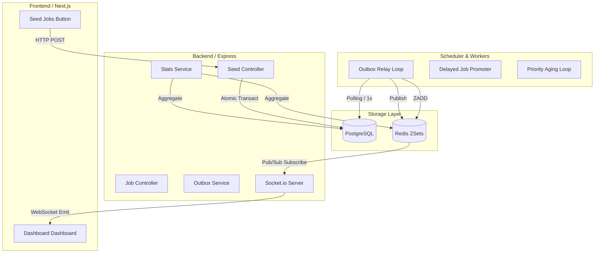

# Pulsar System Documentation

Welcome to the Pulsar system documentation. Pulsar is a robust, high-performance job engine built with TypeScript, Node.js, PostgreSQL, and Redis.

---

## Full System Workflow: Technical Deep Dive

This section provides a comprehensive breakdown of the Pulsar job engine, covering both backend orchestration and frontend real-time synchronization.

### 1. Job Ingestion & Mutation Flows

#### A. Direct Job Insertion (Synchronous)
Used for standard one-off job creations via the REST API.

1.  **Endpoint**: `POST /api/jobs` handled by `jobController.createJob`.
2.  **Middlewares**:
    *   `helmet` / `compression` / `cors`: Standard security and performance.
    *   `express.json`: Body parsing.
    *   `validateRequest(createJobSchema)`: Schema validation (Zod).
3.  **Database**: Inserts a record into the `jobs` table with `status='pending'`.
4.  **Redis Enqueue**:
    *   If `run_at` is immediate: Calls `queueService.enqueueJob` to add the Job ID to `queue:{name}` (Sorted Set).
    *   If `run_at` is future: Calls `queueService.enqueueDelayedJob` to add to `delayed:queue:{name}`.
5.  **Commit**: The database transaction is committed only after the Redis operation succeeds (if immediate).

#### B. Seeded Job Insertion (Transactional Outbox)
Used for bulk operations to ensure atomicity and prevent "ghost jobs" (jobs in Redis with no DB record) or "lost jobs" (jobs in DB but never enqueued).

1.  **Endpoint**: `POST /api/seed` handled by `seedController.seedJobs`.
2.  **Transaction BEGIN**:
    *   **Jobs Table**: Inserts $N$ records into the `jobs` table.
    *   **Outbox Table**: Inserts $N$ corresponding entries into the `outbox` table with `event_type='job_enqueue'`.
3.  **Transaction COMMIT**: Both sets of records are committed atomically.
4.  **Outbox Relay (Background)**:
    *   The `schedulerService` (polling loop every 1s) calls `outboxService.relayPendingEntries`.
    *   It fetches pending outbox entries using `FOR UPDATE SKIP LOCKED` for concurrency safety.
    *   For each entry, it calls `queueService.enqueueJob` (ZADD).
    *   Updates outbox entry status to `processed`.
    *   Publishes an `outbox_update` event to Redis Pub/Sub.

#### C. Updating a Job
1.  **Endpoint**: `PATCH /api/jobs/:id` handled by `jobController.updateJob`.
2.  **State Check**: Fetches the existing job using `FOR UPDATE`.
3.  **Logic**:
    *   If the job is `pending` and the user changed `queue_name`, `priority`, or `run_at`:
        *   `queueService.removeFromQueue(old_queue, id)`: Removes the job from the old Redis set.
        *   `queueService.enqueueJob(...)`: Re-inserts into the new queue/priority position.
4.  **Commit**: Finalizes DB changes.

---

### 2. Real-Time Dashboard Synchronization

#### A. Data Source: The Stats Engine
The `statsService` aggregates data from three sources:
1.  **PostgreSQL**: Job counts by status (`pending`, `completed`, etc.) and throughput metrics.
2.  **Redis**: Current queue depths (`ZCARD`) and sampled data for "Ready" and "Delayed" jobs.
3.  **Outbox**: Status counts of the relay pipeline.

#### B. Live Update Pipeline
1.  **Event Trigger**: Any significant state change (outbox processed, job status change via worker, etc.) publishes a message to the `pulsar:events` channel in Redis.
2.  **Broadcast Node**:
    *   The main server (`server.ts`) maintains a dedicated Redis subscriber.
    *   Upon receiving an event, it fetches fresh stats via `statsService.getStats()`.
    *   It emits two Socket.io events:
        *   `job_update`: Payload metadata for the activity feed.
        *   `stats_update`: Comprehensive snapshot for counters and charts.
3.  **Frontend Consumption**:
    *   **Connection**: `api.service.ts` initializes the Socket.io client.
    *   **Hooks**: `DashboardPage` (Next.js) listens via `socket.on`.
    *   **UI Update**: React state is patched with new stats, triggering fine-grained re-renders (e.g., `AnimatedCounter`).

---

### 3. High-Level Architecture Diagram

---

### 4. Specific Interactive Flows

#### When "Seed ⚡" is clicked:
1.  **Frontend**: Browser sends JSON `{count: 10, ...}` to `/api/seed`.
2.  **Backend**:
    *   Middleware validates payload.
    *   Controller starts PG Transaction.
    *   10 Jobs + 10 Outbox entries created.
    *   Transaction committed.
3.  **Background**:
    *   Outbox Relay (within 1s) enqueues to Redis.
    *   Relay publishes `outbox_update` to Redis.
4.  **Broadcast**:
    *   Server receives Redis message.
    *   Server fetches newest stats (now includes +10 jobs).
    *   Server emits `stats_update` via Socket.io.
5.  **UI**:
    *   Dashboard counters `Pending` and `Outbox Relayed` tick up visually.
    *   Activity Feed shows new job entries.
