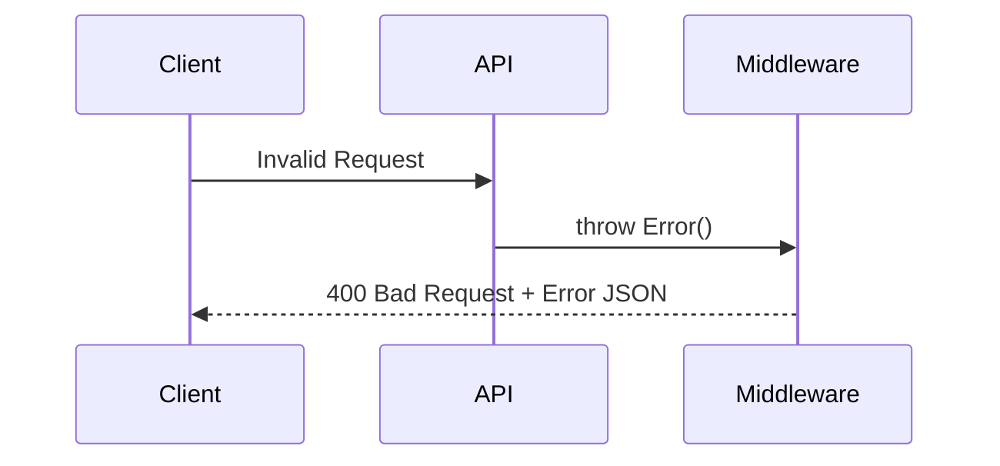

# API Reference

All requests and responses use JSON. The base URL (when running locally) is `http://localhost:3000`.

## 1. System Health & Stats

### `GET /health`
Returns the status of the server and connectivity to downstream services.

**Response:**
```json
{
  "status": "ok",
  "services": {
    "database": "connected",
    "redis": "connected"
  },
  "uptime": "123.45s"
}
```

### `GET /api/stats`
Returns aggregated system metrics including job distribution, queue depths, and outbox relay status.

**Response:**
```json
{
  "jobs": { "total": 100, "pending": 10, "processing": 5, "completed": 80, "failed": 5 },
  "outbox": { "total": 105, "pending": 0, "processed": 105, "failed": 0 },
  "queues": { "depths": { "default": 2 } },
  "throughput_last_60s": 12
}
```

---

## 2. Job Management

### `POST /api/jobs`
Creates a new background job.

| Field | Type | Required | Description |
| :--- | :--- | :--- | :--- |
| `job_type` | `string` | Yes | Type of job (e.g., `email_send`) |
| `payload` | `object` | Yes | Data needed for the job |
| `queue_name`| `string` | No | Target queue. |
| `priority` | `number` | No | 0-10. Higher is more urgent. |
| `run_at` | `ISO Date`| No | Scheduled execution time. |

### `GET /api/jobs`
Fetch a list of recent jobs. Supports filtering by `status` and `queue`.

---

## 3. Worker Control

### `GET /api/workers`
List all registered worker instances and their activity status.

### `POST /api/workers/start`
Dynamically start a new worker thread on a specific queue.

### `POST /api/workers/stop`
Stop a running worker thread by ID.

---

## Error Handling

Pulsar use standard HTTP status codes. Errors are returned in a consistent format:



**Error JSON:**
```json
{
  "error": "Validation Error",
  "message": "job_type is required",
  "statusCode": 400
}
```
