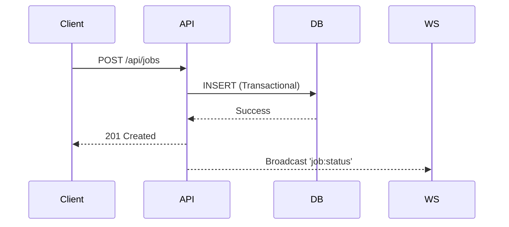

# 🔌 API Reference

The Pulsar API is the central hub for managing jobs and workers. It provides both a RESTful interface for management and a WebSocket interface for real-time telemetry.

**Base URL**: `http://localhost:3000`

---

## 🛰️ REST API

### 1. Job Management

#### `POST /api/jobs`
Creates a new background job.
- **Body**:
  ```json
  {
    "job_type": "email_send",
    "payload": { "to": "user@example.com" },
    "priority": 5,
    "queue_name": "default"
  }
  ```
- **Response**: `201 Created` with the job object.

#### `GET /api/jobs`
Retrieves a paginated list of jobs.
- **Query Params**: `status`, `queue`, `limit`, `offset`.

#### `POST /api/jobs/:id/retry`
Manually triggers a retry for a failed job.

---

### 2. Worker Registry

#### `GET /api/workers`
Returns all active and recently inactive worker instances.

#### `POST /api/workers/stop`
Sends a signal to a worker node to stop processing.
- **Body**: `{ "worker_id": "string" }`

---

### 3. System Health

#### `GET /health`
Infrastructure health check. Returns connectivity status for PostgreSQL and Redis.

#### `GET /api/stats`
Aggregated metrics for the dashboard.

---

## ⚡ WebSocket API (Socket.io)

The dashboard connects via WebSockets to receive real-time updates.

### Server-to-Client Events

| Event | Payload | Description |
| :--- | :--- | :--- |
| `stats:update` | `StatsObject` | Periodic system-wide performance metrics. |
| `job:status` | `JobUpdate` | Triggered whenever a job changes status. |
| `worker:heartbeat`| `WorkerInfo[]`| Broadcasts the current state of all workers. |
| `worker:new` | `WorkerInfo` | Triggered when a new worker node joins. |

### Client-to-Server Events

| Event | Payload | Description |
| :--- | :--- | :--- |
| `job:create` | `JobCreate` | Create a job via WebSocket instead of REST. |
| `worker:scale` | `ScaleOptions`| Request the autoscaler to adjust concurrency. |

---

## 🛠️ Error Format

All errors follow a standard RFC-compliant JSON structure:

```json
{
  "error": "Not Found",
  "message": "Job with ID 123 does not exist",
  "statusCode": 404,
  "timestamp": "2024-03-20T10:00:00Z"
}
```


