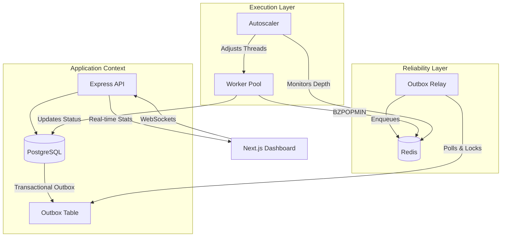

# Architecture Overview

Pulsar is designed with a **decoupled, event-driven architecture** that prioritizes reliability and performance. By separating job submission from execution, Pulsar can handle bursts of traffic without overwhelming backend resources.

---

## The Bridge Architecture

At its core, Pulsar acts as a reliable bridge between your application's database and a high-performance execution environment.

---

## Core Components

### 1. API Server (`/server/src/app.ts`)
The gateway for all interactions. It provides REST endpoints for:
- **Job Creation**: Validating and saving jobs to PostgreSQL.
- **Management**: Pausing, resuming, or cancelling jobs.
- **Monitoring**: Exposing real-time telemetry via Socket.io.

### 2. Transactional Outbox (`/server/src/services/outbox.service.ts`)
The "Secret Sauce" for reliability. Instead of sending a job directly to Redis (which might fail if Redis is down), we save the "intent" to enqueue the job in the same database transaction as the job itself.

### 3. Outbox Relay / Scheduler (`/server/src/services/scheduler.service.ts`)
A lightweight process that polls the Outbox table. It uses **PostgreSQL Advisory Locks** or `SKIP LOCKED` queries to ensure that multiple relay instances don't process the same entry twice. Once a job is successfully enqueued in Redis, it marks the outbox entry as `processed`.

### 4. Redis Priority Queue
We use Redis **Sorted Sets (`ZSET`)** to manage the queue. 
- **Scores**: Calculated based on priority and submission time.
- **Atomicity**: We use Lua scripts or simple `ZADD` operations to ensure queue integrity.

### 5. Worker Pool (`/server/src/worker.ts`)
Independent processes or threads that execute the actual jobs. 
- **Blocking Pop**: Uses `BZPOPMIN` to wait for jobs without consuming CPU.
- **Isolation**: Each job runs in a protected try-catch block to ensure worker stability.

### 6. Autoscaler (`/server/src/services/autoscaler.service.ts`)
Monitors the queue length in Redis. If the queue grows beyond a threshold, it signals the Worker Pool to increase concurrency. If the queue is empty, it scales down to save resources.

---

## Data Flow: The Journey of a Job

1.  **Submission**: Client sends a POST request to `/api/jobs`.
2.  **Persistence**: API starts a DB transaction, saves the `Job` record, and adds an `Outbox` entry.
3.  **Relay**: The Scheduler picks up the `Outbox` entry and pushes the Job ID to Redis.
4.  **Queueing**: Redis places the Job ID in a Sorted Set based on its priority score.
5.  **Execution**: An idle Worker performs a blocking pop from Redis, fetches job details from DB, and executes the task.
6.  **Finalization**: Worker updates the Job status in DB to `completed` or `failed`.
7.  **Telemetry**: Every status change is broadcasted via WebSockets to the Dashboard.

---

## Scalability Strategies

- **Vertical**: Increase worker concurrency (threads) within a single container.
- **Horizontal**: Spin up multiple Worker containers. Each container connects to the same Redis/PostgreSQL.
- **Regional**: Pulsar can be deployed across regions, though latency between Workers and the DB/Redis should be minimized.
