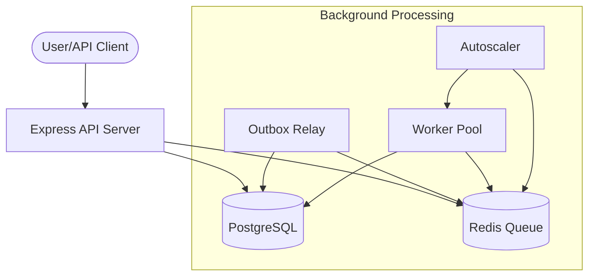
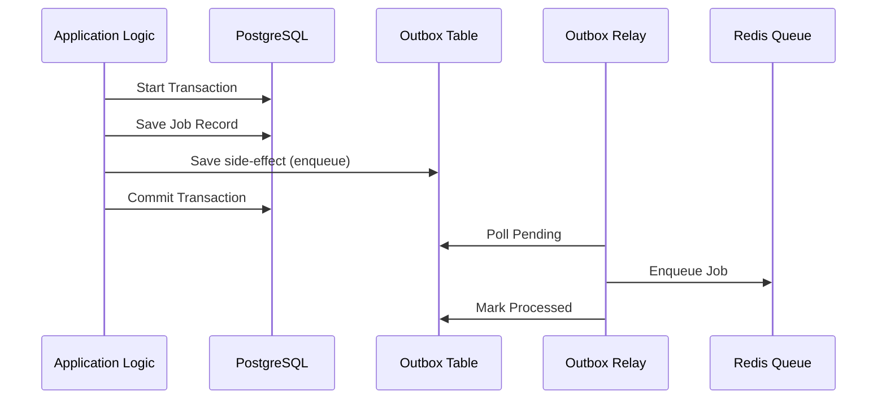
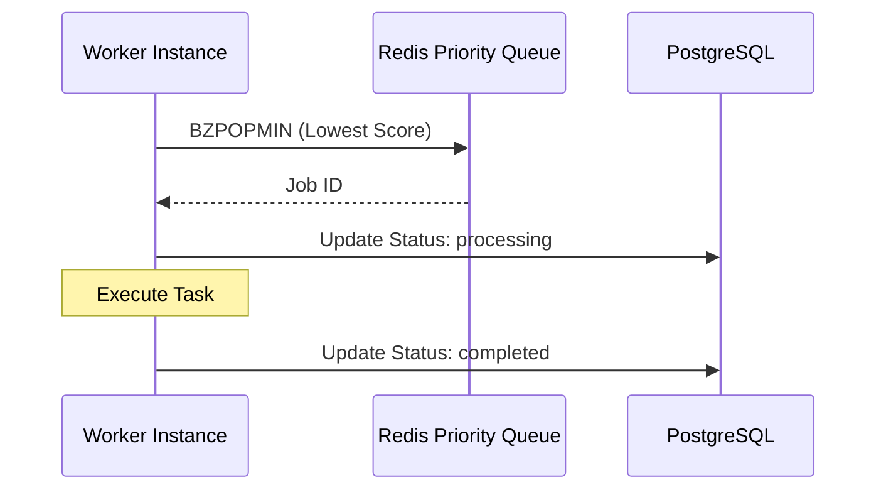

# Architecture Overview

Pulsar is a high-performance job engine designed for reliable, prioritized background processing. It uses a hybrid architecture leveraging **PostgreSQL** for persistence and **Redis** for high-frequency queueing.

## High-Level Architecture



## Directory Structure

```text
pulsar/
├── client/           # Next.js Dashboard Frontend
├── server/           # Express.js Backend & Workers
│   ├── src/
│   │   ├── config/   # Infrastructure Connections
│   │   ├── controllers/ # Request Handlers
│   │   ├── services/ # Business Logic (Outbox, Queue, etc.)
│   │   └── worker.ts # Worker Entry Point
├── docs/             # Central Documentation
└── docker-compose.yml
```

## Core Patterns

### 1. Transactional Outbox
Ensures atomicity between database updates and external side-effects (Redis enqueues).



### 2. Priority Queueing
Jobs are ranked in Redis Sorted Sets using a score calculated from priority and timestamp.



## Scalability & Reliability
- **Horizontal Scaling**: Workers can be scaled independently using Docker.
- **Autoscaling**: A built-in service monitors queue depths and spawns/terminates concurrent worker threads.
- **Resilience**: Failed jobs use **Exponential Backoff** and are stored in a **Delayed Queue** until ready for retry.
- **Reaper**: A secondary fallback process that ensures no job remains "stale" in a pending state forever.
