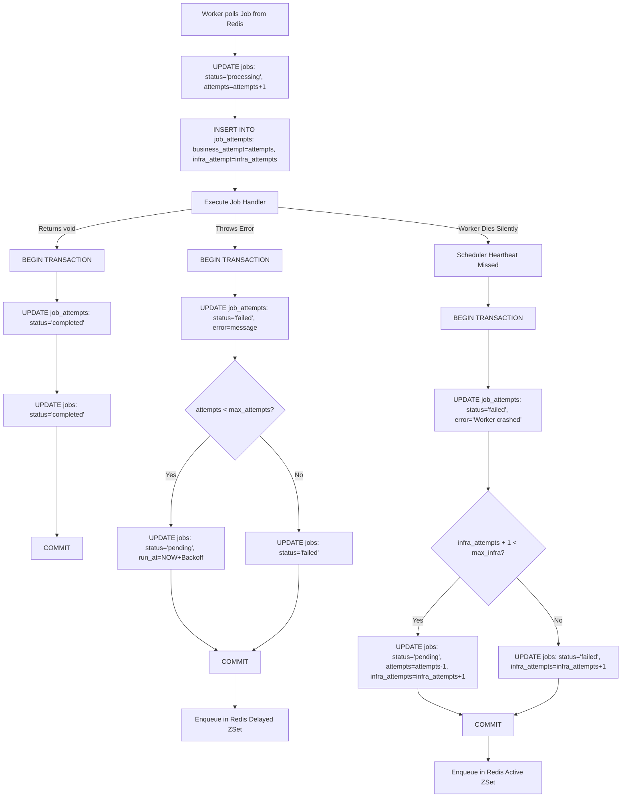

# 🔄 Lifecycle Flow of an Execution Attempt

This document details the exact sequence of events, database transactions, and state changes that occur during a job's execution cycle. It covers the three main execution paths: **Success**, **Business Failure**, and **Infrastructure Crash**.

---

## 🗺️ Execution Flow Overview



---

## 🏃 Details of the Three Scenarios

### 1. The Success Path
This is the golden path where the worker successfully executes the job payload without raising any exceptions.

* **DB Changes (Atomic Transaction)**:
  ```sql
  BEGIN;
  
  -- Update attempt log
  UPDATE job_attempts 
  SET status = 'completed', finished_at = NOW(), execution_time_ms = 4500
  WHERE id = $attemptId AND status = 'processing';
  
  -- Mark job as completed
  UPDATE jobs 
  SET status = 'completed', completed_at = NOW(), updated_at = NOW() 
  WHERE id = $jobId AND status = 'processing';
  
  COMMIT;
  ```
* **Post-Execution**: The worker sets its registry state back to `idle` in Redis and polls for the next job.

---

### 2. The Business Failure Path (Application Exception)
Occurs when the job handler throws an error (e.g., database connection timeout, third-party API returns 500, parsing error).

* **Retry Check**:
  ```typescript
  const canRetry = job.attempts < job.max_attempts;
  const newStatus = canRetry ? 'pending' : 'failed';
  ```
* **Backoff Calculation**:
  Pulsar calculates exponential backoff with a random jitter:
  $$\text{Delay} = \text{base\_delay} \times 2^{\text{attempts} - 1} + \text{Jitter (0-500ms)}$$
* **DB Changes (Atomic Transaction)**:
  ```sql
  BEGIN;
  
  -- Log the failure details
  UPDATE job_attempts 
  SET status = 'failed', error = $errorMessage, stack_trace = $errorStack, finished_at = NOW()
  WHERE id = $attemptId AND status = 'processing';
  
  -- Reset job back to pending with future scheduled run_at
  UPDATE jobs 
  SET status = $newStatus, last_error = $errorMessage, updated_at = NOW(), run_at = $nextRunAt
  WHERE id = $jobId AND status = 'processing';
  
  COMMIT;
  ```
* **Re-queue**: If retrying, the job ID is added to the Redis delayed set `delayed:queue:<name>`.

---

### 3. The Infrastructure Crash Path (Worker Crash/OOM)
Occurs when the worker process terminates abruptly (OOM, SIGKILL, server reboot) without resolving the active database transaction.

* **Detection**: The central scheduler detects that the worker has missed its heartbeats for over 30 seconds.
* **Retry Check**:
  ```typescript
  const nextInfraAttempts = job.infra_attempts + 1;
  const nextAttempts = Math.max(0, job.attempts - 1); // Revert the business attempt increment!
  const canRetry = (nextAttempts < job.max_attempts) && (nextInfraAttempts < job.max_infra_attempts);
  ```
* **DB Changes (Atomic Transaction)**:
  ```sql
  BEGIN;
  
  -- Fail the processing attempt record
  UPDATE job_attempts 
  SET status = 'failed', error = 'Worker crashed during execution', finished_at = NOW()
  WHERE id = $attemptId AND status = 'processing';
  
  -- Revert business attempts, increment infra_attempts, and set status
  UPDATE jobs 
  SET status = $newStatus, attempts = $nextAttempts, infra_attempts = $nextInfraAttempts, run_at = NOW()
  WHERE id = $jobId AND status = 'processing';
  
  COMMIT;
  ```
* **Re-queue**: If retrying, the job is re-enqueued directly into the main Redis active queue `queue:<name>` for immediate execution.
