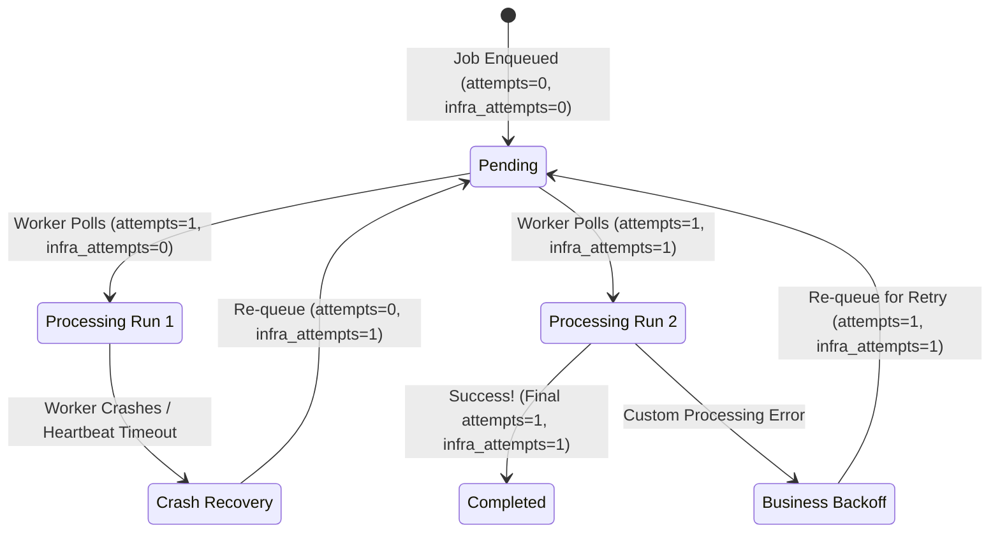

# Understanding Business vs. Infrastructure Attempts

Pulsar distinguishes between **Business Attempts** (application-level logic) and **Infrastructure Attempts** (worker crashes, node evictions, out-of-memory errors). This document explains the core concepts, the rationale behind this separation, and real-life analogies.

---

## The Chef's Kitchen Analogy

To understand why separating attempts is crucial, consider this real-life scenario:

```
┌───────────────────────────────────────────────────────────────────────┐
│                           THE KITCHEN SCENARIO                        │
└───────────────────────────────────────────────────────────────────────┘
                                   │
         ┌─────────────────────────┴─────────────────────────┐
         ▼                                                   ▼
┌─────────────────────────────────┐                 ┌─────────────────────────────────┐
│        BUSINESS RETRY           │                 │       INFRASTRUCTURE RETRY      │
│  (Baking the Soufflé Recipe)    │                 │      (Kitchen Power Outage)     │
├─────────────────────────────────┤                 ├─────────────────────────────────┤
│ The Chef follows the recipe,    │                 │ In the middle of baking, the    │
│ but uses salt instead of sugar. │                 │ kitchen suffers a power outage. │
│ The soufflé collapses.          │                 │ The oven turns off.             │
├─────────────────────────────────┤                 ├─────────────────────────────────┤
│ • Verdict: Recipe/Input issue.  │                 │ • Verdict: System failure.      │
│ • Action: Fix the input and try │                 │ • Action: When power is back,   │
│   again (Attempt 2).            │                 │   start over.                   │
│ • Blame: The recipe/chef.       │                 │ • Blame: The kitchen.           │
└─────────────────────────────────┘                 └─────────────────────────────────┘
```

1. **Business Failure (Baking the Soufflé)**:
   A chef attempts to bake a soufflé. The chef follows the recipe, but because the ingredients were wrong (bad input data) or there is a bug in the recipe (code error), the soufflé collapses. The chef has to throw it away and try again. This is a **Business Attempt**. If it fails repeatedly, the recipe is marked as permanently failed.

2. **Infrastructure Failure (The Kitchen Power Outage)**:
   The chef is in the middle of baking the soufflé, and suddenly the power in the entire restaurant goes out. The oven turns off, and the worker process ceases to exist. This isn't the chef's fault or the recipe's fault—it's a system outage. When the power returns, we must restart baking. This is an **Infrastructure Attempt**. We shouldn't reduce our limit for trying the recipe just because the kitchen lost power!

---

## Why Split the Attempts?

Traditional job queues conflate all errors under a single `attempts` counter. In production, this causes two severe issues:

| Issue | Scenario | Impact without Split | Solution with Pulsar |
| :--- | :--- | :--- | :--- |
| **Starvation from Crashes** | A job is running when a Kubernetes node reboots. The job is interrupted. | The job is retried, but loses one of its few business retries. If nodes reboot multiple times, the job fails permanently without ever hitting a real code error. | Infrastructure retries have their own budget (`max_infra_attempts`). Stale jobs are re-queued without consuming business retry attempts. |
| **Infinite Poison Pills** | A bad payload causes a worker process to crash (e.g., Segfault, Out-of-Memory). | The job keeps re-running, crashing worker after worker, potentially taking down the entire worker pool. | The infrastructure counter (`infra_attempts`) is incremented on crash recovery. Once it hits the limit, the job is marked `failed` to protect the pool. |

---

## Database Mapping

To support this distinction, Pulsar stores separate counters on both the jobs and the historical attempt logs:

### 1. jobs Table
* **`attempts`**: The current number of completed business attempts (incremented when execution starts; decremented if it crashes and is recovered).
* **`max_attempts`**: Maximum allowed business attempts.
* **`infra_attempts`**: The current number of infrastructure-level failures (incremented by the recovery scheduler upon worker crash detection).
* **`max_infra_attempts`**: Maximum allowed infrastructure failures before marking the job as failed.

### 2. job_attempts Table
* **`business_attempt`**: The active business attempt count when this execution started.
* **`infra_attempt`**: The active infrastructure attempt count when this execution started.

---

## State Diagram: How Attempts Progress

Below is the state transitions of the two counters through crashes and retries:


