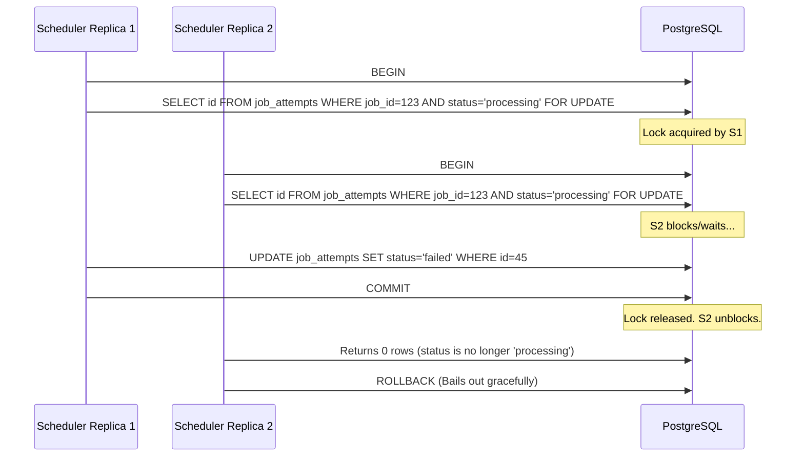

# Concurrency, Locking and Idempotency

This document details Pulsar's distributed coordination model. It explains how Pulsar prevents duplicate job execution (idempotency) and handles recovery concurrency control using multi-layer locking (Redis pop operations, PostgreSQL state transitions, and row-level locks).

---

## The Double-Pickup Problem (The Interview Scenario)

In a high-scale distributed environment, two worker processes (or threads) might poll the queue simultaneously. If there is no concurrency control, both workers could fetch the same job, leading to:
1. **Duplicate Execution**: Sending a notification email or processing a credit card charge twice.
2. **State Corruption**: Writing conflicting updates to the database.

Pulsar solves this by combining the **destructiveness of Redis pops** with **atomic PostgreSQL updates**.

---

## Multi-Layer Locking Strategy

Pulsar implements a three-tier locking and claim verification strategy:

```
┌────────────────────────────────────────────────────────┐
│                      THE CLAIM FLOW                    │
└────────────────────────────────────────────────────────┘
                            │
               [1. ATOMIC REDIS DESTRUCTION]
  Worker calls zPopMin() -> ID is removed from Redis queue.
  Prevents any other worker from popping the same ID.
                            │
                            ▼
           [2. ATOMIC DATABASE STATE TRANSACTION]
  Worker executes: UPDATE jobs SET status = 'processing'
  WHERE id = $id AND status = 'pending' AND run_at <= NOW().
  Forces DB to verify the job status is still 'pending'.
                            │
              ┌─────────────┴─────────────┐
              ▼ (Success: Row Count = 1)   ▼ (Failure: Row Count = 0)
     ┌───────────────────────────┐   ┌───────────────────────────┐
     │   Worker claims job!      │   │   Bail out!               │
     │   Proceeds to execute     │   │   Another thread claimed  │
     │   business logic.         │   │   it or it ran early.     │
     └───────────────────────────┘   └───────────────────────────┘
```

### 1. Layer 1: Atomic Redis Destruction (`zPopMin`)
Unlike Redis `zRange` (which only reads elements), `zPopMin` reads and **removes** the job ID from the Redis Sorted Set in a single atomic transaction. Once a worker pops a job, no other worker fetching from the queue can see it.

### 2. Layer 2: Optimistic Database State Claim
If a worker gets a job ID from Redis, it does not immediately trust that it owns the job. It issues an atomic SQL `UPDATE` statement:
```sql
UPDATE jobs 
SET status = 'processing', 
    attempts = attempts + 1, 
    updated_at = NOW() 
WHERE id = $1 
  AND status = 'pending' 
  AND run_at <= NOW() 
RETURNING *;
```
* **Why this is safe**: The database query engine executes the row lock and update atomically. If worker A updates the status to `processing`, the row no longer matches the `WHERE status = 'pending'` clause for worker B.
* **Result**: Exactly one worker will get a result with `rowCount === 1`. The loser gets `rowCount === 0` and silently discards the job, preventing duplicate runs.

---

## Exclusive Row Locking in Recovery (`FOR UPDATE`)

When a worker crashes, the central Scheduler triggers recovery. If multiple scheduler replicas detect the crash at the same time, they could try to recover the same job. 

Pulsar implements **exclusive pessimistic row locks** using PostgreSQL `FOR UPDATE` to serialize recovery.



### The Lock Mechanism
1. **Acquire Row Lock**:
   ```sql
   SELECT id FROM job_attempts 
   WHERE job_id = $1 AND worker_id = $2 AND status = 'processing'
   ORDER BY started_at DESC LIMIT 1
   FOR UPDATE;
   ```
   The `FOR UPDATE` clause instructs PostgreSQL to acquire an exclusive lock on the selected row. Any other transaction requesting a lock on this row will block until this transaction issues `COMMIT` or `ROLLBACK`.
2. **Verify State Retention**:
   Once the lock is acquired, Pulsar runs the update:
   ```sql
   UPDATE job_attempts 
   SET status = 'failed', finished_at = NOW()
   WHERE id = $attemptId AND status = 'processing';
   ```
   If another node managed to update this row while the scheduler was waiting for the lock, the `status = 'processing'` clause fails, `rowCount` returns `0`, and we safely rollback.

---

## Common Interview Questions and Answers

### Q: What is the difference between Optimistic and Pessimistic locking? Where does Pulsar use them?
**A**: 
* **Optimistic Locking**: Doesn't lock rows during read; instead, it checks column values (e.g., `status = 'pending'`) at update time. Pulsar uses this in the worker's poll-and-claim step (`pollAndProcess`) to avoid blocking DB transactions.
* **Pessimistic Locking**: Locks the rows immediately on select, blocking other transactions. Pulsar uses this in the scheduler crash recovery step (`recoverWorker`) via `FOR UPDATE` to guarantee that only one scheduler instance can mutate the crashed job state.

### Q: Why isn't Redis zPopMin alone sufficient to guarantee idempotency?
**A**: Redis is an in-memory data store. If a network partition occurs between the worker and Redis, the worker might pop the job, but the connection could fail before it updates PostgreSQL. If Redis fails or restarts, or if the outbox relay synchronizes a duplicate record, the database status acts as the ultimate source of truth.
