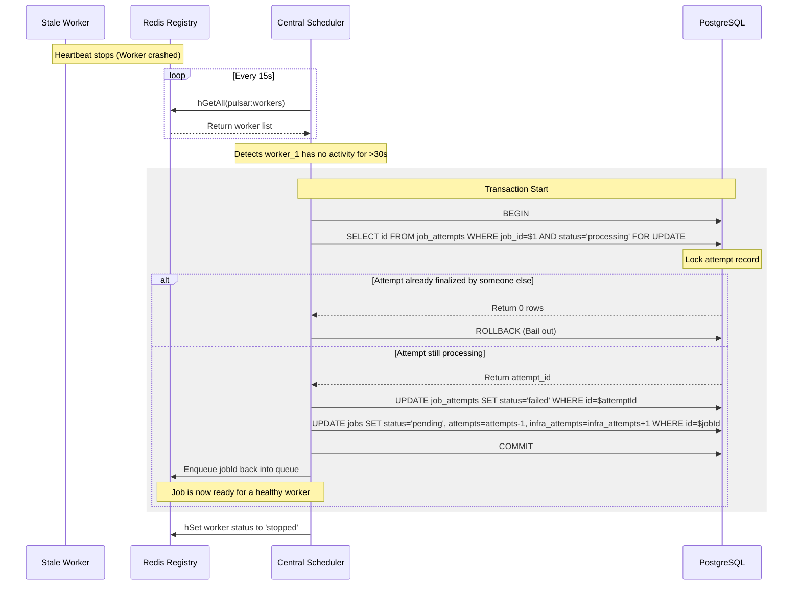

# Crash Detection and Recovery Mechanism

Pulsar features a fully automated, database-backed **Death Watch** system that monitors worker health, detects crashes, and performs safe, race-free failover of active tasks.

---

## The Package Delivery Analogy

To understand how the crash recovery system works, consider a real-life package delivery service:

```
                  ┌───────────────────────────────┐
                  │       DISPATCH MANAGER        │
                  │       (Scheduler Loop)        │
                  └───────────────┬───────────────┘
                                  │
         ┌────────────────────────┴────────────────────────┐
         ▼                                                 ▼
┌─────────────────────────────────┐               ┌─────────────────────────────────┐
│     NORMAL GPS HEARTBEAT        │               │       TRUCK BREAKS DOWN         │
├─────────────────────────────────┤               ├─────────────────────────────────┤
│ The delivery truck (Worker)     │               │ The truck stops sending GPS     │
│ pings the office every 10 mins  │               │ updates for 1 hour. Dispatch    │
│ to report its location.         │               │ assumes the truck broke down.   │
├─────────────────────────────────┤               ├─────────────────────────────────┤
│ • Verdict: Driver is safe.      │               │ • Action: Dispatcher marks the  │
│ • State: Processing route.      │               │   run failed, recovers the parcel│
│                                 │               │   and puts it on a new truck.   │
└─────────────────────────────────┘               └─────────────────────────────────┘
```

1. **Active Heartbeats**:
   A delivery driver pings the main office every 10 minutes (heartbeat) to report they are working on a route. As long as they keep pinging, the dispatcher knows the delivery is under way.

2. **Missed Pings (OOM/Crash)**:
   If a driver stops pinging for 1 hour, the dispatcher doesn't wait indefinitely. The dispatcher assumes the truck broke down (crashed). The dispatcher immediately marks that delivery run as failed, recovers the package coordinates, assigns it to a new truck, and increments the fleet's breakdown counter.

---

## How Pulsar Detects Crashes

1. **Redis Registry (`pulsar:workers`)**:
   Every active worker process has a hash entry in Redis containing:
   * `worker_id`
   * `status` (`idle`, `processing`, or `stopped`)
   * `active_job_ids` (array of job IDs currently processing)
   * `last_activity` (timestamp of the last heartbeat)

2. **Heartbeat Loop**:
   Every worker runs a lightweight background timer that updates its registry entry in Redis every **10 seconds**, resetting `last_activity` to the current time.

3. **Death Watch (Scheduler)**:
   The central scheduler runs a recovery loop every **15 seconds** which scans all registered workers in Redis:
   ```typescript
   if (now - lastActivity >= 30_000) { // 30 seconds TTL
       // Worker is considered stale! Trigger recovery.
   }
   ```

---

## Race-Free Failover (Concurrency Control)

In a distributed environment, multiple scheduler nodes might run the recovery check simultaneously. To prevent duplicate recovery runs or recovery races with a worker that is actually running slowly, Pulsar uses **atomic database locks** (`FOR UPDATE`).

### Step-by-Step Sequence



### The Recovery SQL Query
```sql
-- 1. Lock the active attempt record
SELECT id FROM job_attempts 
WHERE job_id = $jobId AND worker_id = $workerId AND status = 'processing'
ORDER BY started_at DESC LIMIT 1
FOR UPDATE;

-- 2. Mark attempt failed
UPDATE job_attempts 
SET status = 'failed', 
    error = 'Worker crashed during execution', 
    finished_at = NOW(),
    execution_time_ms = EXTRACT(EPOCH FROM (NOW() - started_at)) * 1000
WHERE id = $attemptId;

-- 3. Reset job state
UPDATE jobs 
SET status = 'pending', 
    attempts = $revertedAttempts,
    infra_attempts = $nextInfraAttempts,
    updated_at = NOW(), 
    last_error = 'Worker crashed during execution',
    run_at = NOW()
WHERE id = $jobId AND status = 'processing';
```
