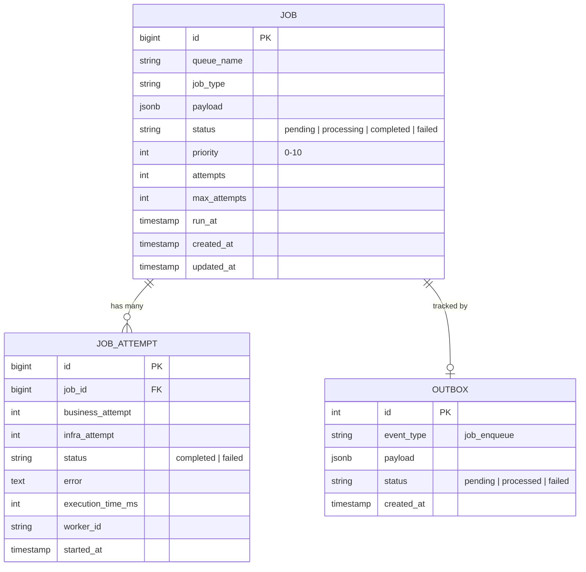

# 💾 Database Schema

Pulsar uses **PostgreSQL** as its primary source of truth. All job states, historical attempts, and outbox entries are persisted here to ensure 100% reliability.

## 🛠️ ORM: Prisma

The project uses **Prisma** for schema management and type-safe database access. 

- **Schema File**: `server/prisma/schema.prisma`
- **Migrations**: Managed via `npx prisma migrate`

---

## 🗺️ Entity Relationship Diagram

---

## 📂 Table Details

### 1. `jobs` Table
The central registry for all tasks.

| Column | Type | Nullable | Default | Description |
| :--- | :--- | :--- | :--- | :--- |
| `id` | `BIGSERIAL` | NO | - | Unique Job ID |
| `queue_name` | `VARCHAR` | NO | 'default' | Logical queue name |
| `job_type` | `VARCHAR` | NO | - | Type identifier for workers |
| `payload` | `JSONB` | NO | {} | Arbitrary data for the job |
| `status` | `VARCHAR` | NO | 'pending' | Current lifecycle state |
| `priority` | `INT` | NO | 0 | 0 (Low) to 10 (High) |
| `attempts` | `INT` | NO | 0 | Current number of tries |
| `max_attempts`| `INT` | NO | 5 | Max retries before failure |
| `run_at` | `TIMESTAMP` | NO | NOW() | Scheduled execution time |

### 2. `job_attempts` Table
Detailed execution logs for every attempt.

| Column | Type | Description |
| :--- | :--- | :--- |
| `id` | `BIGSERIAL` | Unique Attempt ID |
| `job_id` | `BIGINT` | Link to the parent Job |
| `business_attempt` | `INT` | The business attempt number of the job at the start of this execution |
| `infra_attempt` | `INT` | The infrastructure attempt number (crashes) at the start of this execution |
| `status` | `VARCHAR` | Result of the attempt |
| `error` | `TEXT` | Stack trace or error message if failed |
| `execution_time_ms`| `INT` | Latency of the business logic |
| `worker_id` | `VARCHAR` | ID of the worker that processed this |

### 3. `outbox` Table
The reliability bridge between DB and Redis.

| Column | Type | Description |
| :--- | :--- | :--- |
| `id` | `SERIAL` | Unique Outbox ID |
| `event_type` | `VARCHAR` | Usually `job_enqueue` |
| `payload` | `JSONB` | Contains `job_id` and `priority` |
| `status` | `VARCHAR` | `pending` -> `processed` |

---

## ⚡ Performance Optimization (Indexes)

To handle high volumes of jobs, the following indexes are implemented:

- **`idx_jobs_status_run_at`**: `(status, run_at)` - Powers the scheduler to find ready jobs efficiently.
- **`idx_outbox_status_pending`**: `(status)` - Used by the Relay to poll for pending enqueues.
- **`idx_jobs_queue_priority`**: `(queue_name, priority)` - Supports dashboard filtering and bulk operations.
- **`idx_job_attempts_job_id`**: `(job_id)` - Fast lookup for job history in the dashboard.
