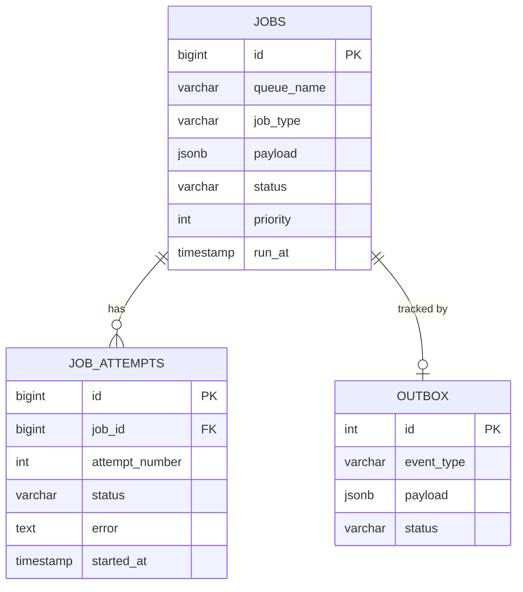

# Database Schema

Pulsar uses PostgreSQL as the source of truth for all job data.

## Tables Overview

## `jobs` Table
Core table storing job metadata and current state.

| Column | Type | Description |
| :--- | :--- | :--- |
| `id` | `BIGSERIAL` | Primary Key |
| `queue_name` | `VARCHAR` | e.g. `notifications`, `media`, `default` |
| `job_type` | `VARCHAR` | e.g. `email_send` |
| `payload` | `JSONB` | Data passed to the worker |
| `status` | `VARCHAR` | `pending`, `processing`, `completed`, `failed` |
| `priority` | `INT` | 0 (low) to 10 (high) |
| `run_at` | `TIMESTAMP` | When the job is scheduled to run |

## `job_attempts` Table
Historical log of every execution attempt for a job.

| Column | Type | Description |
| :--- | :--- | :--- |
| `id` | `BIGSERIAL` | Primary Key |
| `job_id` | `BIGINT` | Foreign Key to `jobs` |
| `status` | `VARCHAR` | `completed` or `failed` |
| `error` | `TEXT` | Failure message |
| `execution_time_ms`| `INT` | How long the attempt took |

## `outbox` Table
Ensures atomic side-effects (e.g., Redis enqueuing).

| Column | Type | Description |
| :--- | :--- | :--- |
| `id` | `SERIAL` | Primary Key |
| `event_type` | `VARCHAR` | `job_enqueue` |
| `payload` | `JSONB` | Data needed by the relay |
| `status` | `VARCHAR` | `pending`, `processed`, `failed` |

## Indexes
- `idx_jobs_status_run_at`: Optimized for fetching ready jobs.
- `idx_outbox_status_pending`: Optimized for the Outbox relay worker.
- `idx_job_attempts_job_id`: Optimized for fetching history of a specific job.
