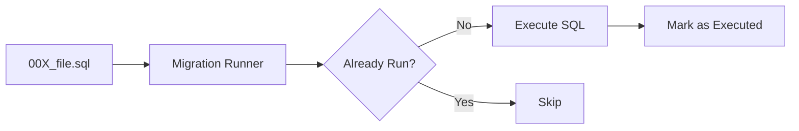

# Development Guide

This guide covers setting up and running Pulsar for local development.

## 1. Environment Setup

Pulsar requires Node.js 22+, PostgreSQL, and Redis.

### Local Configuration
1. Install dependencies: `pnpm install` in both `client` and `server` folders.
2. Setup environment variables:
   - `cp server/.env.example server/.env.development`
   - `cp client/.env.example client/.env.local`

## 2. Running Pulsar

### Option A: Docker (Recommended)
Docker Compose manages the API, Workers, Frontend, DB, and Redis.

```bash
docker compose up -d --build
```
- **Dashboard**: `http://localhost:3001`
- **Server API**: `http://localhost:3000`

### Option B: Local Execution
Run each component in a separate terminal.

```bash
# Terminal 1: Database Migrations
cd server && pnpm db:migrate:dev

# Terminal 2: API Server
cd server && pnpm dev

# Terminal 3: Background Worker
cd server && pnpm worker:dev

# Terminal 4: Frontend
cd client && pnpm dev
```

---

## 3. Database Migrations

Pulsar uses an idempotent, file-based migration system.



- **New Migration**: Add a `.sql` file in `server/src/db/migrations/`.
- **Run**: `pnpm db:migrate:dev`

---

## 4. Data Seeding

Simulate realistic workloads and failure scenarios using the seeding script.

```bash
# Docker
docker exec -it pulsar-app-1 pnpm seed:jobs

# Local
cd server && pnpm seed:jobs:dev
```

This will create a mix of immediate and delayed jobs with various priority levels and failure probabilities.
