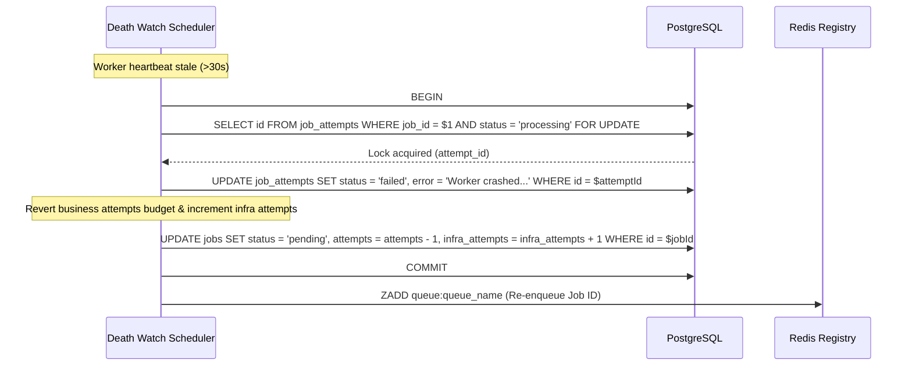

# 🕵️ Stuck Job Recovery & The Reaper Service

This document describes how Pulsar handles job failures and recoveries depending on where a worker crashes, how the **Job Reaper** recovers lost jobs, and how **Priority Aging** prevents low-priority starvation.

---

## 🌪️ Recovery Scenarios: Where Did the Worker Crash?

A worker can crash in three distinct execution phases. Pulsar handles each phase differently to prevent duplicate runs or lost jobs:

```
                  ┌─────────────────────────────────────────┐
                  │          WHERE DID IT CRASH?            │
                  └────────────────────┬────────────────────┘
                                       │
         ┌─────────────────────────────┼─────────────────────────────┐
         ▼                             ▼                             ▼
┌─────────────────────────┐   ┌─────────────────────────┐   ┌─────────────────────────┐
│     1. IN QUEUE         │   │   2. DURING PICKUP      │   │    3. IN EXECUTION      │
│  (Waiting in Redis)     │   │   (Popped, before DB)   │   │   (status='processing') │
├─────────────────────────┤   ├─────────────────────────┤   ├─────────────────────────┤
│ Job is in Redis Sorted  │   │ Popped from Redis, but  │   │ DB status is            │
│ Set. DB is 'pending'.   │   │ worker dies before claim│   │ 'processing'. Heartbeat │
│ No worker is assigned.  │   │ transaction is executed.│   │ stops for 30s.          │
├─────────────────────────┤   ├─────────────────────────┤   ├─────────────────────────┤
│ • Result: Safe. Healthy │   │ • Result: Lost in Redis │   │ • Result: Stuck in DB.  │
│   worker will pop it    │   │ • Action: Job Reaper    │   │ • Action: Death Watch   │
│   normally.             │   │   re-enqueues it.       │   │   performs failover.    │
└─────────────────────────┘   └─────────────────────────┘   └─────────────────────────┘
```

### Scenario 1: Worker crashes while job is waiting in the queue
* **State**: Job resides in `queue:queue_name` (Redis) and `jobs` table has `status = 'pending'`.
* **Recovery**: No action needed. The job is completely safe because no worker has claimed it. A different, healthy worker will eventually pop it.

---

### Scenario 2: Worker crashes during pickup (Popped, before DB transaction)
* **State**: The worker executes `zPopMin` (which removes the job from Redis) but crashes before executing `UPDATE jobs SET status = 'processing'`. 
* **The Problem**: The job is now lost from Redis, but remains in PostgreSQL with `status = 'pending'`. It will sit in the database forever.
* **The Solution (The Job Reaper)**:
  * The Scheduler runs the **Job Reaper** (`reSyncPendingJobs`) every **5 minutes**.
  * It scans PostgreSQL for jobs stuck in `pending` status that haven't been updated for over 5 minutes:
    ```sql
    SELECT id, priority, queue_name 
    FROM jobs 
    WHERE status = 'pending' 
      AND (updated_at < NOW() - INTERVAL '5 minutes' OR updated_at IS NULL);
    ```
  * The Reaper re-enqueues these jobs back into the active Redis Sorted Set and updates their `updated_at` timestamps to avoid polling them on the next loop.

---

### Scenario 3: Worker crashes during execution (status = 'processing')
* **State**: Database shows `status = 'processing'`, and `job_attempts` has an active attempt. The worker process crashes.
* **The Problem**: The job is locked in the `processing` state and will never finish.
* **The Solution (Death Watch / Stale Worker Recovery)**:
  * The Scheduler scans active heartbeats every **15 seconds** (`recoverStaleWorkers`).
  * If a worker hasn't updated its heartbeat for $>30$ seconds, it is marked as `stopped`.
  * The scheduler executes `recoverWorker` to perform atomic failover (see details below).

---

## 🛠️ The Stale Worker Recovery Flow

When recovering a crashed worker's active jobs, Pulsar executes a transaction that reverts attempts and increments infrastructure failure counters:



---

## ⚖️ Queue Fairness & Priority Aging

In priority queues, high-priority jobs can cause **starvation**—a condition where low-priority jobs wait indefinitely because high-priority jobs are continuously enqueued ahead of them.

Pulsar solves this using **Priority Aging**:
* **Interval**: Every **30 seconds**, the Scheduler invokes `applyPriorityAging`.
* **Detection**: It queries PostgreSQL for jobs stuck in `pending` for more than 1 minute with a priority level below 10:
  ```sql
  SELECT id, priority, queue_name, EXTRACT(EPOCH FROM created_at) * 1000 as created_at_ms
  FROM jobs 
  WHERE status = 'pending' 
    AND created_at < NOW() - INTERVAL '1 minute'
    AND priority < 10;
  ```
* **Promotion**:
  1. Increments the job's priority by 1 (`priority = priority + 1`).
  2. Updates PostgreSQL and re-enqueues the job in Redis with the new priority score.
  3. **Order Preservation**: To maintain fairness within the new priority level, Pulsar uses the job's *original* `created_at` timestamp as the score suffix, ensuring that older starved jobs are executed before newly enqueued jobs of the same priority level.

---

## ❓ Common Interview Questions & Answers

### Q: Why not run the Job Reaper every few seconds?
**A**: Scanning the database for stale `pending` jobs requires checking timestamps and performing table scans. Running this at a high frequency would overwhelm the database with heavy queries. Since worker crashes during pickup are extremely rare edge cases, a 5-minute interval is a perfect compromise between consistency guarantees and database performance.

### Q: What happens if a job crashes the worker repeatedly due to OOM?
**A**: If a job consumes too much memory and causes worker processes to crash, the Stale Worker Recovery system increments `infra_attempts` on each crash. Once `infra_attempts` reaches `max_infra_attempts` (default: 3), the recovery process marks the job as `failed` (instead of `pending`), preventing a "poison pill" from repeatedly taking down the entire pool of worker instances.
