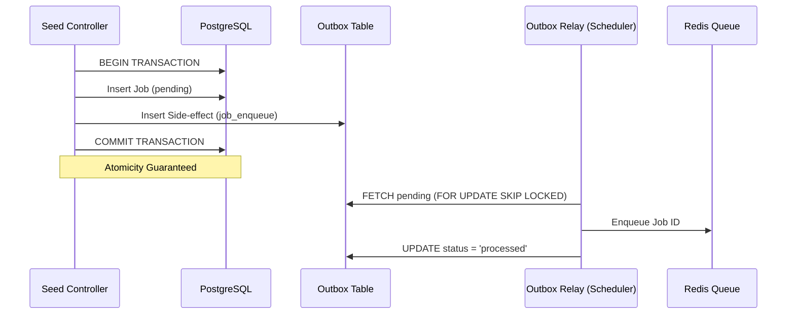

# Transactional Outbox Pattern in Pulsar

## Overview
The **Transactional Outbox Pattern** ensures that database updates and external side-effects (like enqueuing a job in Redis) happen atomically. This prevents "starved" jobs that exist in the database but are never executed because the Redis enqueue failed or the server crashed mid-operation.

## Architecture

## Key Components

### 1. Outbox Table
A dedicated table to store pending actions. Each row contains:
- `event_type`: The action to perform (e.g., `job_enqueue`).
- `payload`: Data needed for the action (e.g., `job_id`, `priority`).
- `status`: Lifecycle of the event (`pending`, `processed`, `failed`).

### 2. Outbox Service
Provides methods to:
- `addEntry()`: Record a side-effect. Can participate in an existing DB transaction.
- `relayPendingEntries()`: Processes the outbox using row-level locking to allow multiple concurrent relay instances without collision.

### 3. Outbox Relay (Scheduler)
The `schedulerService` polls the outbox table every second. It acts as the bridge between the database and Redis.

### 4. Job Reaper (Fallback)
As a secondary safety net, the `Job Reaper` runs every 5 minutes to scan for jobs that are stuck in `pending` status for too long. This covers extreme edge cases where both the immediate enqueue and the outbox relay might have failed.

## Benefits
- **Zero Race Conditions**: Workers will never try to pull a job from Redis before the DB transaction has fully committed.
- **Resilience**: If Redis is down, the outbox entries remain `pending` and will be automatically retried by the relay when Redis recovers.
- **Monitoring**: The dashboard provides real-time visibility into the relay pipeline status.
