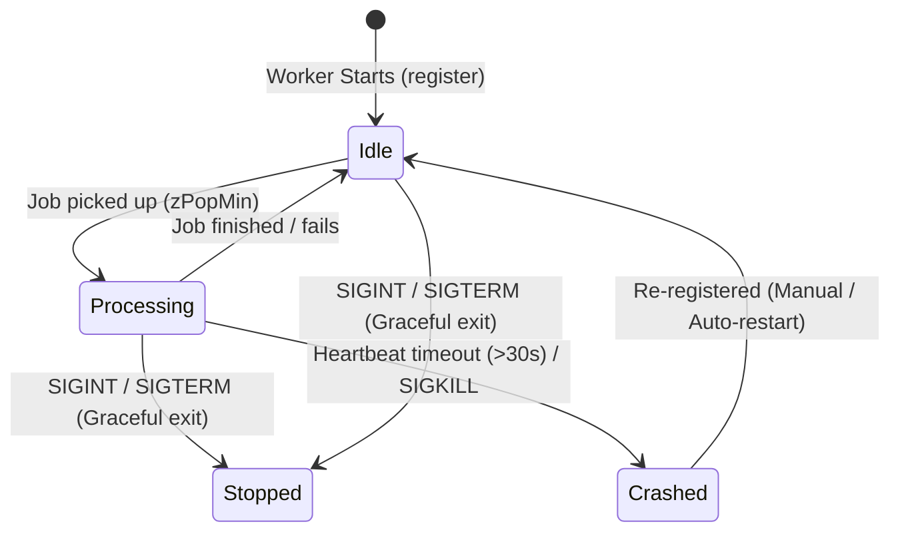

# Worker Lifecycle and Process Management

This document details the life cycle of a Pulsar worker, including health checks, state transitions, graceful shutdown signal handling, and self-healing worker management.

---

## Worker State Machine

Pulsar workers transition through various states to guarantee job isolation and safe crash recovery. Below is the state machine representation:



---

## Step-by-Step Lifecycle Phases

### 1. Bootstrapping and Registration
When a worker process starts:
1. It connects to **Redis** and **PostgreSQL**.
2. Generates a unique `worker_id` combining the static configuration name and the host suffix (e.g., `notifications-worker-4e2b8c9d`).
3. Queries the `worker_settings` table in PostgreSQL to retrieve configuration overrides (`auto_restart`, `adaptive_scaling`). If no overrides exist, it seeds defaults.
4. Registers itself in the Redis registry under the hash key `pulsar:workers` with a 30-second TTL logic:
   ```typescript
   const info: WorkerInfo = {
     worker_id: workerId,
     queue_name: queueName,
     status: 'idle',
     concurrency: 1,
     adaptive_scaling: dbAdaptiveScaling,
     auto_restart: dbAutoRestart,
     last_activity: Date.now(),
     hostname: os.hostname(),
     pid: process.pid,
     active_jobs: []
   };
   await redisClient.hSet('pulsar:workers', workerId, JSON.stringify(info));
   ```

---

### 2. Heartbeats (Active Keeping)
* The worker runs a background interval timer every **10 seconds** that repeats the registration function.
* This updates `last_activity = Date.now()` in Redis, preventing the scheduler's **Death Watch** thread from treating the worker as crashed.

---

### 3. Graceful Shutdown and Signal Handling
When a Kubernetes pod/container is evicted, or when a developer restarts the worker, the operating system sends `SIGTERM` or `SIGINT` signals.

Pulsar intercepts these signals to prevent interrupting in-flight jobs:
```typescript
const shutdown = async (signal: string) => {
  logger.info(`Received ${signal}, shutting down gracefully...`, 'WORKER');

  // Stop the main polling loop (prevents picking up NEW jobs)
  workerService.stopInstance(uniqueWorkerId);
  
  // Set status to stopped and remove from the active registry immediately
  await workerRegistry.unregister(uniqueWorkerId);

  // Close database pool to release connection slots
  await pool.end();

  process.exit(0);
};

process.on('SIGINT', () => shutdown('SIGINT'));
process.on('SIGTERM', () => shutdown('SIGTERM'));
```

---

### 4. Self-Healing and API-Driven Restarts
The dashboard allows administrators to manually stop, restart, or simulate crashes on worker nodes. This is implemented via Redis Pub/Sub control channels:

* **Stop Signal**:
  Receiving `pulsar:worker_control` with `action: 'stop'` triggers `workerService.stopInstance()`. The worker stops pulling jobs, clears heartbeats, and updates its registry state to `stopped`.
* **Start/Restart Signal**:
  Receiving `pulsar:worker_control` with `action: 'start'` triggers `workerService.startInstance()`. The worker re-registers in Redis, spawns the poller, and resumes processing.
* **Crash Simulation**:
  Receiving `pulsar:worker_control` with `action: 'crash'` stops the poller loop and clears the heartbeat timer *without* updating the Redis registry. This mimics a sudden power failure or `SIGKILL`, allowing developers to test the **Death Watch** recovery system.

---

## Common Interview Questions and Answers

### Q: Why handle SIGTERM gracefully? Why not let the OS kill the process?
**A**: If a process is forcefully killed (`SIGKILL`), any jobs currently executing on that process remain marked as `processing` in the database, requiring the stale worker recovery system to clean them up (which takes up to 30 seconds). By handling `SIGTERM`, we can unregister immediately, let active jobs finish, and keep the database clean, achieving zero-downtime deployments.

### Q: What is the "Ghost Heartbeat" problem and how is it resolved?
**A**: A "Ghost Heartbeat" occurs when a dying/lagging worker process sends a delayed heartbeat right after a new instance has started or after it was marked as `stopped` by an admin. Pulsar solves this by checking the registry status during heartbeat updates: if the worker's registered status is explicitly `stopped`, the heartbeat function rejects the registration request unless a manual `force` flag is passed.
