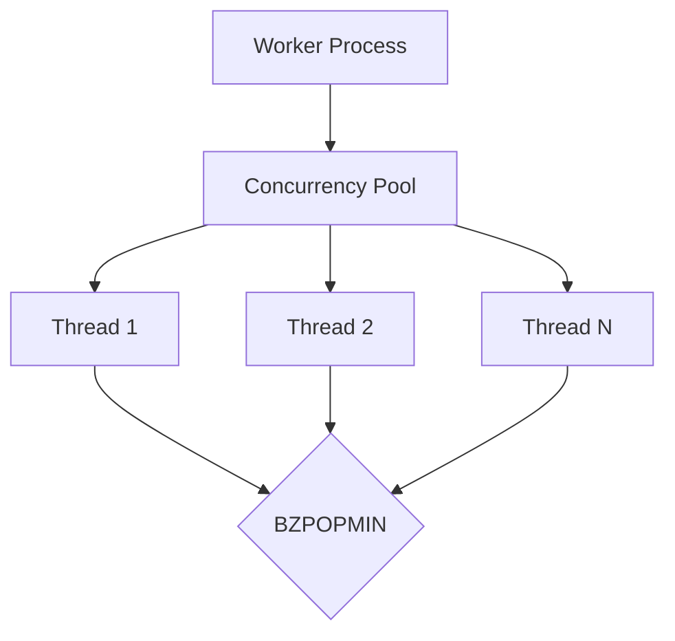
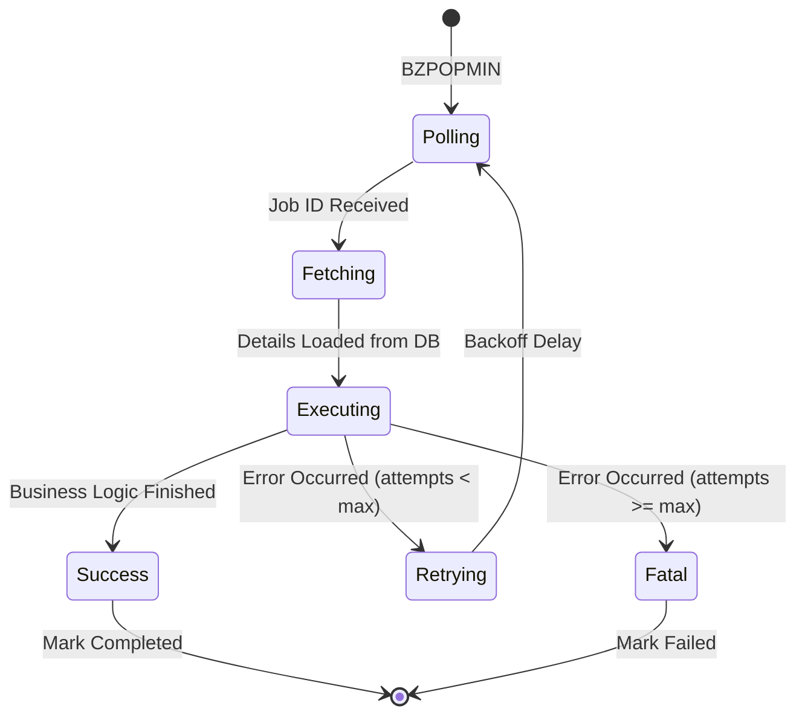

# Worker System Deep Dive

The Worker Module is the heartbeat of Pulsar. It is responsible for consuming jobs from Redis, executing business logic, and reporting outcomes back to the database.

---

## Thread Management

Pulsar workers are designed to be highly concurrent. A single Worker process can manage multiple "Worker Threads" (logical concurrency) to maximize resource utilization.

### Dynamic Concurrency
The number of active threads can be adjusted at runtime by the **Autoscaler**. This allows the system to scale up during heavy loads and scale down to near-zero when idle.

---

## The Job Lifecycle

When a worker thread picks up a job, it enters a strictly defined state machine to ensure no job is lost or stuck.

### 1. Atomic Pickup
We use Redis `BZPOPMIN` which is atomic. Once a job ID is popped, it's removed from the queue. If the worker crashes *immediately* after popping but before starting, the **Job Reaper** will eventually find the job stuck in `pending` and re-enqueue it.

### 2. Execution Sandbox
Each job is executed within a `try-catch` block. 
- **Timeouts**: Jobs have a maximum execution time. If they exceed it, the worker terminates the task and marks it as failed.
- **Resource Limits**: (Optional) Workers can be configured to monitor memory usage and restart if they leak.

---

## Priority and Scoring Logic

Pulsar uses a sophisticated scoring system in Redis Sorted Sets to ensure strict priority adherence while preventing "starvation" of lower-priority jobs.

**The Formula:**
`Score = (MAX_PRIORITY - job.priority) * 10^13 + job.timestamp`

- **Priority Range**: 0 (lowest) to 10 (highest).
- **Result**: Higher priority jobs always have significantly lower scores, placing them at the front of the queue. Among jobs with the same priority, the oldest one (smallest timestamp) comes first.

---

## Error Handling and Retries

Pulsar supports **Exponential Backoff** for failed jobs.

| Attempt | Delay Formula | Example Delay |
| :--- | :--- | :--- |
| 1 | `base_delay * 2^0` | 10s |
| 2 | `base_delay * 2^1` | 20s |
| 3 | `base_delay * 2^2` | 40s |
| 4 | `base_delay * 2^3` | 80s |

### Dead Letter Queue (DLQ)
When a job exceeds its maximum retry count, it is moved to a `failed` state in the database. These can be manually inspected and "re-run" from the Dashboard.

---

## Telemetry and Heartbeats

Each worker instance maintains a heartbeat in Redis.
- **Registry**: Workers register themselves on startup with their capabilities and ID.
- **Health Checks**: If a heartbeat is missed for > 30 seconds, the system considers the worker "dead" and marks any jobs it was processing as `pending` for re-pickup.
