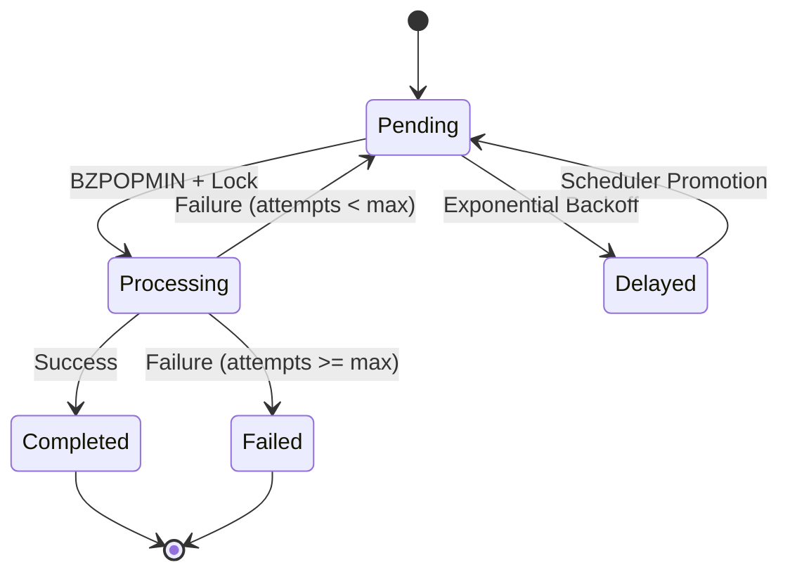
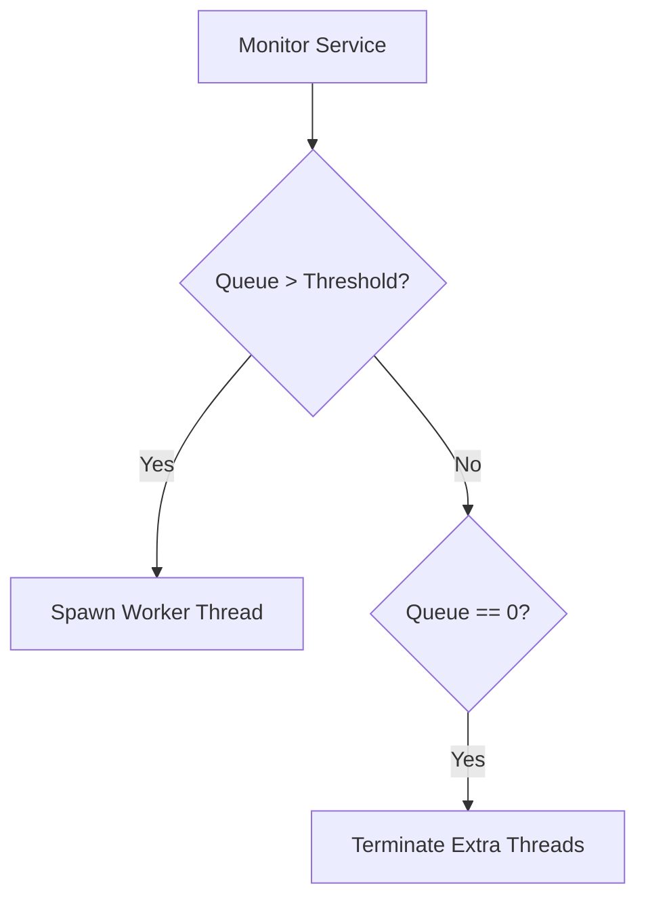

# Worker System Deep Dive

The Worker Module is the engine of Pulsar, responsible for executing tasks enqueued in Redis and updating their status in PostgreSQL.

## ⚙️ Core Logic

### 1. High-Performance Polling
Workers use the Redis `BZPOPMIN` command to poll for jobs. This is a blocking operation that waits for a job to appear in the Sorted Set, providing:
- **Low Latency**: Near-instant job pickup.
- **Low CPU**: No polling loops when the queue is empty.

### 2. Job Priority & Scoring
Jobs are enqueued with a calculated score:
`Score = (10 - priority) * 10^13 + timestamp`
The worker picks the **lowest score** first, ensuring that high-priority jobs (higher `priority` value = lower score) are processed before lower priority ones.

### 3. Job Lifecycle

## 🚀 Autoscaling
Pulsar features a dynamic autoscaler that monitors queue depths.

- **Scale Up**: New concurrent worker logic instances are initialized dynamically.
- **Scale Down**: Idle threads are Terminated when the queue is fully drained.

## 🧪 Failure Simulation
Each job can have a `failure_mode` (`succeed`, `fail`, `probably_fail`) allowing you to test:
- **Resilience**: How the system handles retries.
- **Backoff**: Verification that retry intervals increase exponentially.
- **Visibility**: Ensuring failed jobs are correctly marked in the dashboard.
